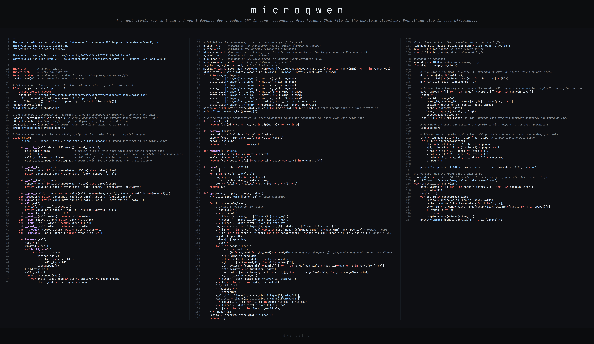

# microqwen

The 2017 Transformer architecture has stood the test of time with just a few key tweaks. Inspired by @karpathy’s amazing [microgpt](https://karpathy.github.io/2026/02/12/microgpt/), 
here is a version updated with Qwen 3 modernities: RoPE, QKNorm, GQA, and SwiGLU. Hand-edited to keep Andrej’s original clarity & purity - still fits in 3 columns!



## Rotary Position Embeddings (RoPE)

microgpt uses GPT-2's learned position vector (`wpe`) which is added to the token embedding. RoPE (Rotary Position Embeddings) replaces this, encoding
position by rotating the query and key vectors by an angle that depends on position in the sequence.

```python
def rope(x, pos, theta=100.0):
    out = []
    for i in range(0, len(x), 2):
        ang = pos / theta ** (i / len(x))
        c, s = math.cos(ang), math.sin(ang)
        out += [x[i] * c - x[i+1] * s, x[i+1] * c + x[i] * s]
    return out
```

The vector is treated as a set of 2D pairs `(x[0], x[1])`, `(x[2], x[3])`, and so on, and each pair is rotated as a point in a 2D plane. You can do this
because each dimension is orthogonal (and so are the 2D planes from each other). When a query rotated by angle mθ is dot product'd with a key rotated by nθ, the result depends only on the difference (m − n)θ. So attention scores become a function of relative distance with zero learned parameters. Clever.

Each pair rotates at a different speed. The first pair spins fast; later pairs spin slowly. Ultimately that means local information will get encoded in the early pairs and distant information in the later pairs. The `theta` parameter sets how spread out those speeds are. Production models use 10,000 or much larger, but those values assume head dimensions of 64+ and contexts in the thousands. With `head_dim = 4` we only get two pairs, and at 10,000 the slow one would barely move across 16 tokens, so we use 100.

RoPE is applied per head, to q and k only (values carry content, not position). The key is rotated before it goes into the KV cache, so every cached key is rotated exactly once, at its own position:

```python
q = [z for h in range(n_head) for z in rope(rmsnorm(q[h*head_dim:(h+1)*head_dim], qn), pos_id)] # QKNorm + RoPE
k = [z for h in range(n_kv_head) for z in rope(rmsnorm(k[h*head_dim:(h+1)*head_dim], kn), pos_id)] # QKNorm + RoPE
```

Note that autograd needed no new blocks for this. The angles are plain floats computed from the position, so `math.cos` never touches a `Value`. From autograd's point of view, a rotation is just multiplying by constants and adding, which it already supports.

## RMSNorm and QKNorm

RMSNorm (Root Mean Square Normalization) rescales a vector so its values have unit root-mean-square. It divides every element by the square root of the mean of the squares:

```python
def rmsnorm(x, w=None):
    ms = sum(xi * xi for xi in x) / len(x)
    scale = (ms + 1e-5) ** -0.5
    return [xi * scale * w[i] if w else xi * scale for i, xi in enumerate(x)]
```

It's a stripped-down LayerNorm that was in the original transformer paper. LayerNorm subtracts the mean and then divides by the standard deviation, while RMSNorm skips the mean subtraction. It turns out the re-centering contributes little and the re-scaling does the real work of keeping activations from drifting larger or smaller as they flow through the network. The new optional argument `w` added in microqwen is a learnable gain, one weight per dimension. Pure normalization forces every vector onto the same scale, which is sometimes too rigid; the gain lets the model learn how large each dimension should be after normalizing. The 'w' learnable gain is only used in QKNorm (see below).

**Where the norms go.** microgpt already upgraded from LayerNorm to RMSNorm. Like GPT-2, the Qwen model is *pre-norm*: each block normalizes its input before the attention or MLP, and the residual stream itself is never normalized in place. We made two placement changes to match Qwen 3. The RMSNorm right after the token embedding is gone, since the first block already normalizes its input. And a final RMSNorm is applied after the last block, just before `lm_head`:

```python
x = rmsnorm(x)
logits = linear(x, state_dict['lm_head'])
```

The residual stream accumulates the outputs of every block and can drift in scale, so normalizing it once more before reading out logits keeps the output projection well-conditioned.

**QKNorm.** The third new location is inside attention. The attention logit is a dot product q·k, and nothing stops q and k from growing large during training, which would cause softmax to saturate into a near one-hot distribution, gradients through it to vanish, and training to become unstable. Before RoPE, each head's query and key slice passes through its own RMSNorm. The q and k norms each get a learnable gain vector, initialized to 1 and shared across heads:

```python
state_dict[f'layer{i}.q_norm'] = matrix(1, head_dim, std=0, mean=1.0)
state_dict[f'layer{i}.k_norm'] = matrix(1, head_dim, std=0, mean=1.0)
```
The order is important: normalize first, then rotate. Rotation preserves length, so the norm's survives RoPE.

## Grouped Query Attention (GQA)

In standard multi-head attention, every query head has its own key and value head. GQA (Grouped Query Attention) lets groups of query heads share one K/V head to reduce number of learned paramters.
We keep 4 query heads but only 2 KV heads:

```python
n_head = 4      # number of attention heads
n_kv_head = 2   # number of key/value heads for Grouped Query Attention (GQA)
head_dim = n_embd // n_head # derived dimension of each head
kv_dim = n_kv_head * head_dim # width of k and v
```

The key and value projections shrink accordingly, from 16 outputs to 8:

```python
state_dict[f'layer{i}.attn_wk'] = matrix(kv_dim, n_embd)
state_dict[f'layer{i}.attn_wv'] = matrix(kv_dim, n_embd)
```

Inside the head loop, each query head works out which KV head it belongs to:

```python
ks = (h // (n_head // n_kv_head)) * head_dim # each group of n_head // n_kv_head query heads shares one KV head
q_h = q[hs:hs+head_dim]
k_h = [ki[ks:ks+head_dim] for ki in keys[li]]
v_h = [vi[ks:ks+head_dim] for vi in values[li]]
```

`n_head // n_kv_head` is the group size (2 here), and integer division buckets consecutive heads together: query heads 0 and 1 read KV head 0, and heads 2 and 3 read KV head 1. 

## Swish-Gated Linear Unit (SwiGLU)

The FFN where the transformer's memory is located. The original feed-forward network (FFN) projects up, applies ReLU, and projects down. You can think of this as memory retrieval because the up projection + ReLU acts as the key selection and then down projection is the retrieved (learned) information passed through. SwiGLU (Swish-Gated Linear Unit) replaces this with a gated design: two parallel up-projections, one of which, passed through a smooth activation, and acts as a gate on the other.

```python
x_mlp_fc1 = linear(x, state_dict[f'layer{li}.mlp_fc1'])
x_mlp_fc2 = linear(x, state_dict[f'layer{li}.mlp_fc2'])
x = [xi.silu() * xj for xi, xj in zip(x_mlp_fc1, x_mlp_fc2)]
x = linear(x, state_dict[f'layer{li}.mlp_fc3'])
```

`fc1` is the gate, `fc2` carries content, and `fc3` projects back down. The elementwise product means each hidden unit's contribution is scaled by an input-dependent gate, rather than just being switched on or off by ReLU. 

The gate uses SiLU, x·σ(x), a smooth cousin of ReLU. It needed a new addition in autograd, with its local gradient derived by the product rule:

```python
def silu(self):
    s = 1/(1+math.exp(-self.data))
    return Value(self.data*s, (self,), (s*(1+self.data*(1-s)),))
```

The original FFN has two matrices at 4d × d, so 8d² parameters. SwiGLU has three matrices at h × d, so 3hd. Setting 3hd = 8d² gives h = (8/3)d. We approximate to 3 here. Why does it work better? I don't know, ask Noam Shazeer :). 

Finally, Qwen 3 has 28 repeated transformer blocks (`n_layer`) even in the small model and has larger dimensions, which we didn't configure here for simplicity. 
In total (this change + removing positional embeddings + GQA), the model goes from 4,192 to 3,944 parameters. Has similar val loss (the benefits are seen when you scale the model). 


